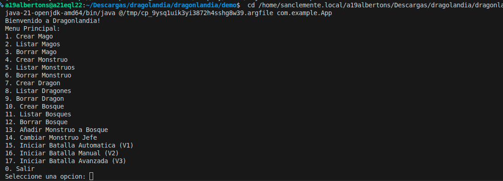
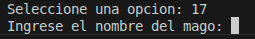
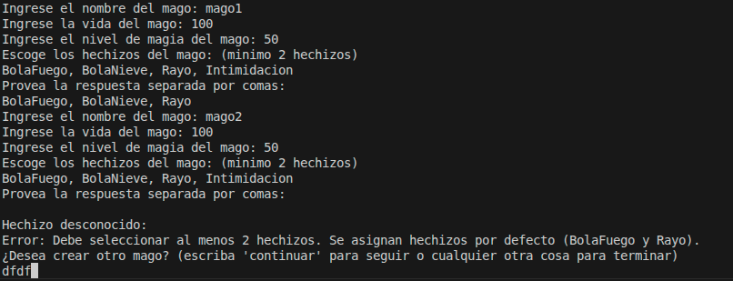
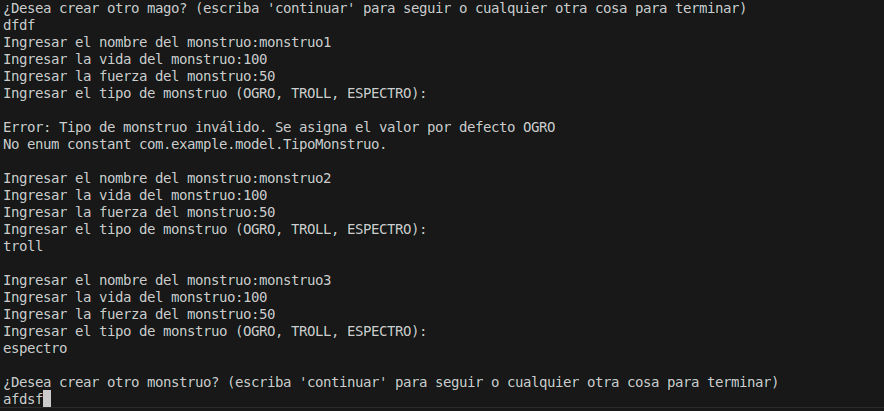
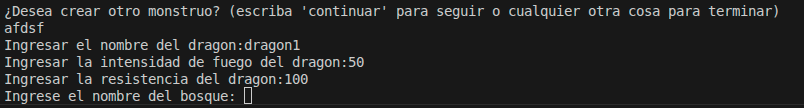
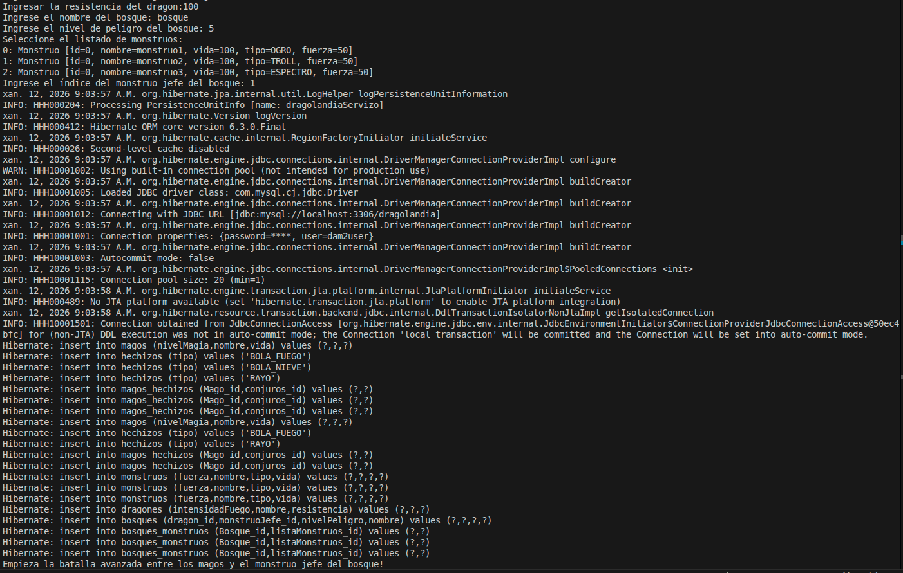
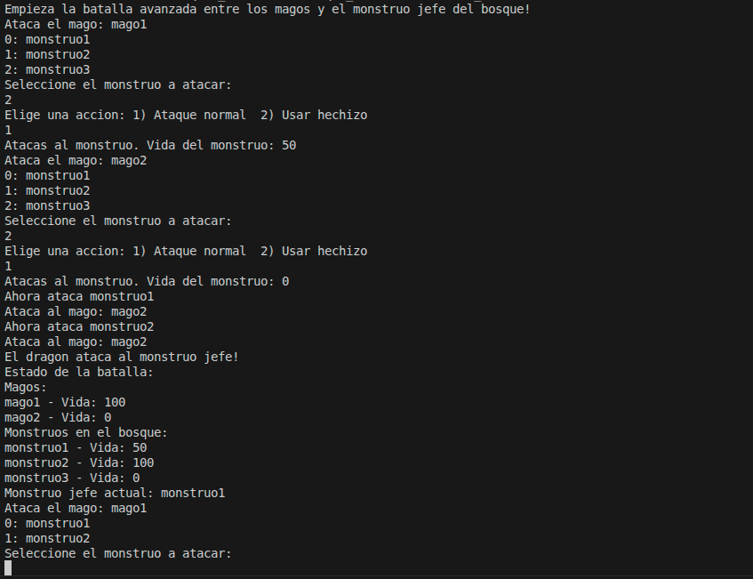
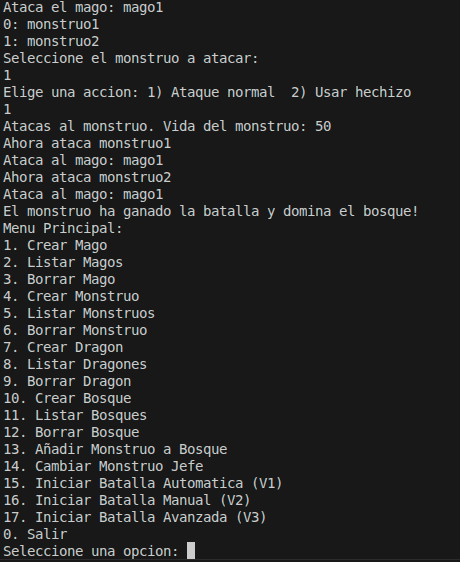

# Manual de Usuario
Ejemplo de uso de la aplicación en su version final

## Uso del combate de la version final
inicio programa

eleccion opcion de juego

creacion magos

creacion monstruos

creacion dragones

creacion bosque

manejo de una ronda

Fin programa
